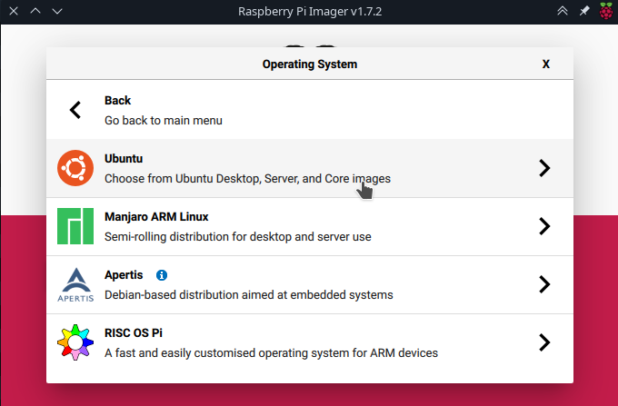
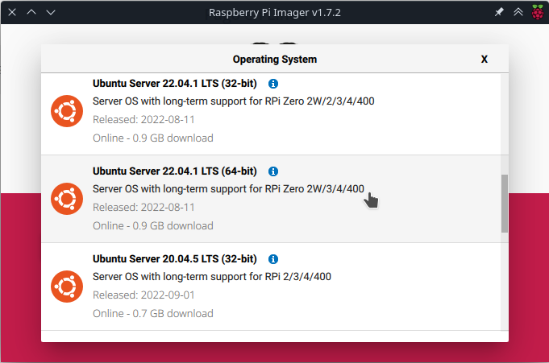
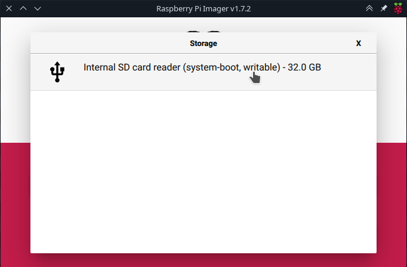
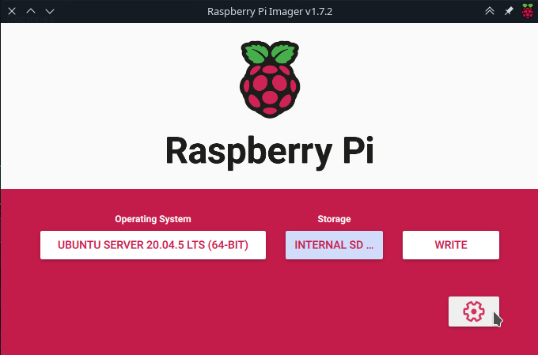
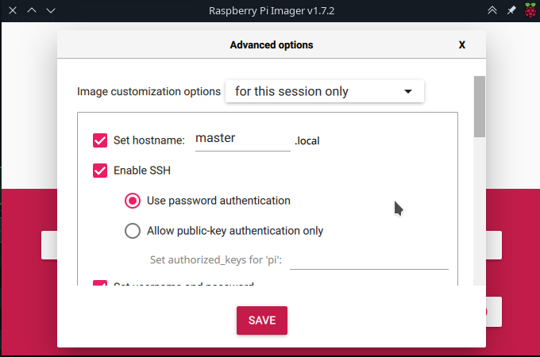
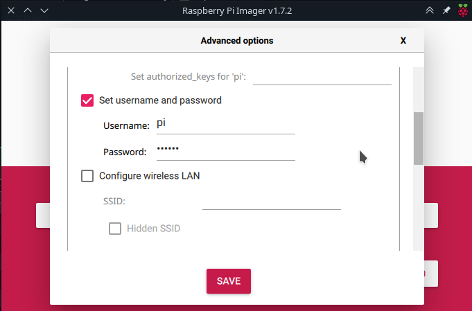
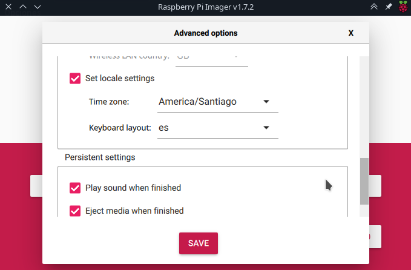
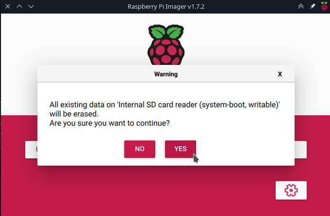
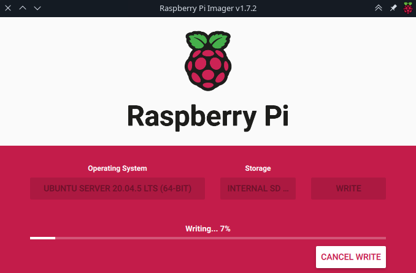

## Instalación de Sistema Operativo

Para la instalación del sistema operativo en las memorias Micro SD se utiliza la aplicación *Raspberry Pi Imager v1.7.2* 

Al pulsar el botón *Operating System* se selecciona la opción de *Other general-purpose OS*:

Luego se elige *Ubuntu*:

Finalmente se elige *Ubuntu Server 22.04.1 LTS de 64 bits*.

En el botón de *Storage* se selección la Micro SD que contendrá el sistema operativo.

Luego se configuran opciones del sistema operativo a instalar pulsando el botón con la rueda dentada:

Se establece el nombre de la máquina con *Set hostname*. Los nombres usados fueron: **Master**, **Worker1**, **Worker2** y **Worker3**. También se activa la conexión por ssh al activar *Enable SSH* y marcando *Use password authentication*:

Se configura el usuario y contraseña del sistema operativo. En este caso el usuario es **pi** y la contraseña **rbpi01** 

Se establece la zona horaria en *America/Santiago* y la distribución del teclado español como *es*

Finalmente se confirma la instalación del sistema operativo:

Y se espera a que termine la instalación:

Luego es posible instalar la tarjeta MicroSD en la Raspberry para arrancar el sistema operativo. Se recomienda que en el primer arranque se conecte la Raspberry a un monitor y teclado para observar que todo funcione correctamente. En la primera ejecución se ejecuta el servicio *cloud-init* de manera automática para configurar el sistema operativo y se debe esperar a que termine. Este proceso demora unos 2 minutos aproximadamente. Igualmente se puede conectar la Raspberry a internet para aplicar actualizaciones del sistema operativo.